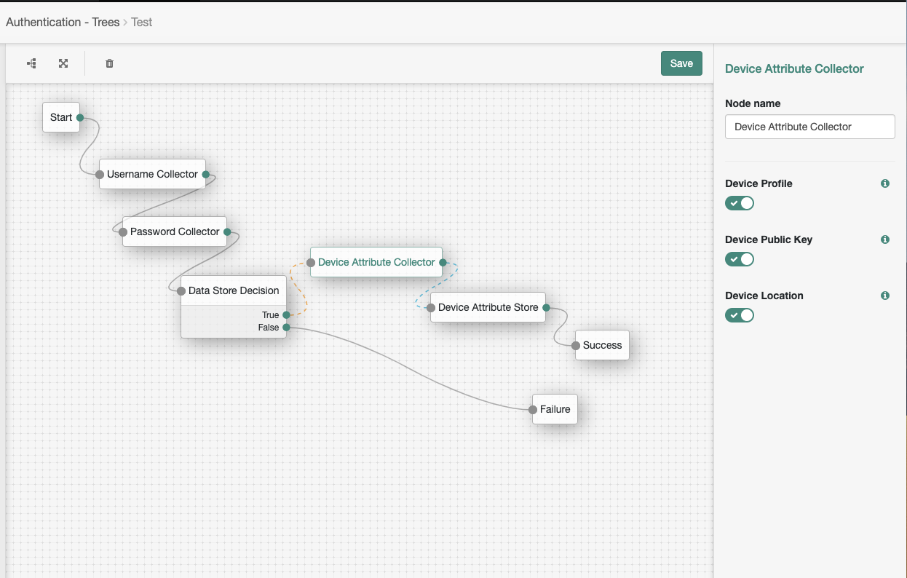

<!--
 * The contents of this file are subject to the terms of the Common Development and
 * Distribution License (the License). You may not use this file except in compliance with the
 * License.
 *
 * You can obtain a copy of the License at legal/CDDLv1.0.txt. See the License for the
 * specific language governing permission and limitations under the License.
 *
 * When distributing Covered Software, include this CDDL Header Notice in each file and include
 * the License file at legal/CDDLv1.0.txt. If applicable, add the following below the CDDL
 * Header, with the fields enclosed by brackets [] replaced by your own identifying
 * information: "Portions copyright [year] [name of copyright owner]".
 *
 * Copyright 2019 ForgeRock AS.
-->
# Device Attribute Collector Node & Device Attribute Store Node

Simple Device Attribute Collector Node and Device Attribute Store Node for ForgeRock's [Identity Platform][forgerock_platform] 6.5.2 and above. This node collect device attribute and persist to data store (DJ).

Copy the .jar file from the ../target directory into the ../web-container/webapps/openam/WEB-INF/lib directory where AM is deployed.  Restart the web container to pick up the new node.  The node will then appear in the authentication trees components palette.

**Usage**

The code in this repository has binary dependencies that live in the ForgeRock maven repository. Maven can be configured to authenticate to this repository by following the following [ForgeRock Knowledge Base Article](https://backstage.forgerock.com/knowledge/kb/article/a74096897).

There are 3 types of data can be collected:

| Device Attribute     | Description                                  |  Json Attribute key       |
| -------------------- |:--------------------------------------------:| -------------------------:|
| Device Profile       | General device profile, e.g model, version   | profile                   |
| Device Public Key    | Public Key to use for signature verification | publicKey                 |
| Device Last Location | Device Last Location                         | location                  |

***Sample Device Profile Collected Data***
```json
{
  "identifier": "ec3f8bbee78406bb-NtheX1L1Z2zjW/c4FrPo3X+zyb8=",
  "profile": {
    "bluetooth": {
      "supported": false
    },
    "telephony": {
      "networkCountryIso": "us",
      "carrierName": "Android"
    },
    "browser": {
      "agent": "Dalvik/2.1.0 (Linux; U; Android 9; AOSP on IA Emulator Build/PSR1.180720.117)"
    },
    "version": "1.0",
    "platform": {
      "jailBreakScore": 1,
      "timeZone": "America/Vancouver",
      "model": "AOSP on IA Emulator",
      "locale": "en_US",
      "version": 29,
      "device": "generic_x86_arm",
      "deviceName": "AOSP on IA Emulator",
      "brand": "google",
      "platform": "Android"
    },
    "hardware": {
      "memory": 1494,
      "display": {
        "orientation": 1,
        "width": 1440,
        "height": 2621
      },
      "cpu": 4,
      "storage": 774,
      "camera": {
        "numberOfCameras": 2
      },
      "hardware": "ranchu",
      "manufacturer": "Google"
    },
    "network": {
      "connected": true
    }
  },
  "location": {
    "latitude": 232,
    "longtitude": 123
  },
  "publicKey": {
    "key": "12344"
  }
}
```

**Build Instruction**

```shell script
mvn package
```

To skip test
```shell script
mvn package -DskipTests
```

**DJ Schema**
```ldif
#
# Copyright 2016-2019 ForgeRock AS. All Rights Reserved
#
# Use of this code requires a commercial software license with ForgeRock AS.
# or with one of its affiliates. All use shall be exclusively subject
# to such license between the licensee and ForgeRock AS.
#
dn: cn=schema
changetype: modify
add: attributeTypes
attributeTypes: ( 1.3.6.1.4.1.36734.2.2.1.1
  NAME 'deviceAttributes'
  DESC 'Device Attribute string'
  SYNTAX 1.3.6.1.4.1.1466.115.121.1.15
  X-STABILITY 'Internal'
  X-ORIGIN 'OpenAM' )
-
add: objectClasses
objectClasses: ( 1.3.6.1.4.1.36734.2.2.2.1
  NAME 'deviceAttributeContainer'
  DESC 'Class containing device attributes'
  SUP top
  AUXILIARY
  MAY ( deviceAttributes )
  X-STABILITY 'Internal'
  X-ORIGIN 'OpenAM' )
```

To apply the schema
```shell script
ldapmodify --hostname opendj.example.com --port 1389 --bindDN "cn=Directory Manager" --bindPassword <password> <your ldif file>.ldif
```

You need to add objectclass `deviceAttributeContainer` to the user

**Screen Shot**



        
The sample code described herein is provided on an "as is" basis, without warranty of any kind, to the fullest extent permitted by law. ForgeRock does not warrant or guarantee the individual success developers may have in implementing the sample code on their development platforms or in production configurations.

ForgeRock does not warrant, guarantee or make any representations regarding the use, results of use, accuracy, timeliness or completeness of any data or information relating to the sample code. ForgeRock disclaims all warranties, expressed or implied, and in particular, disclaims all warranties of merchantability, and warranties related to the code, or any service or software related thereto.

ForgeRock shall not be liable for any direct, indirect or consequential damages or costs of any type arising out of any action taken by you or others related to the sample code.

[forgerock_platform]: https://www.forgerock.com/platform/  
